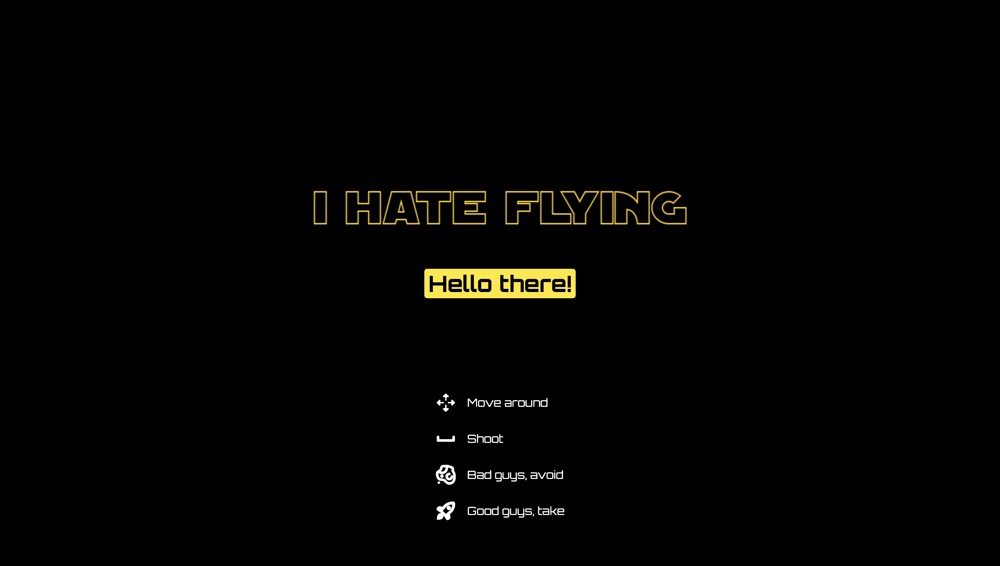
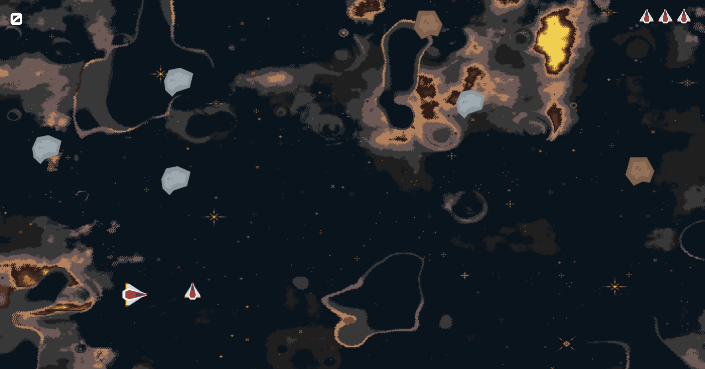

# I HATE FLYING

## [Play the Game](https://cristinachaparro.github.io/i-hate-flying/)

# Description

Obi-Wan Kenobi, who hates to fly, has been designated by the Jedi Council to go on a mission to stop the Pykes from trafficking with their spice. While doing so, he ends up in the Kessel Run, having to avoid many asteroids. Will he survive to tell the story?

# Main Functionalities

- One spaceship that moves up, down, right and left.
- Several asteroids coming from the right side of the canvas.
- You can shoot lasers to destroy the asteroids.
- Each annihilated asteroid adds a point.

# Backlog Functionalities

- Enemies shoot back to you.
- Max lives.
- Increase lives's speed so that it's more difficult to get them.

# Project Structure

## main.js

- startGame()
- startWithIntro()

## game.js

- Game ()
- flyingAsteroids()
- checkCollision()
- removeAsteroids()
- shoot()
- checkLaserCollision()
- flyingExtraLives()
- checkExtraLivesCollision()
- addLifeShipImage()
- checkCanvasCollision()
- checkLives()
- removeExtraLife()
- win()
- gameOver()
- gameLoop () {}

## spaceShip.js

- SpaceShip()
- drawSpaceShip()
- spaceShipUp()
- spaceShipDown()
- spaceShipRight()
- spaceShipLeft()

## asteroid.js

- Asteroid()
- drawAsteroid()
- movingAsteroid()

## laser.js

- Laser()
- drawLaser()
- movingLaser()

## extraLife.js

- ExtraLife()
- drawExtraLife()
- movingExtraLife()

# States and Transitions

- Splash screen
- Intro screen
- Game screen
- Gameover screen
- Winner screen

# Extra Links

### Trello
[Link](https://trello.com/b/itXGPIru/workflow)

### Slides
[Link](www.your-url-here.com)

